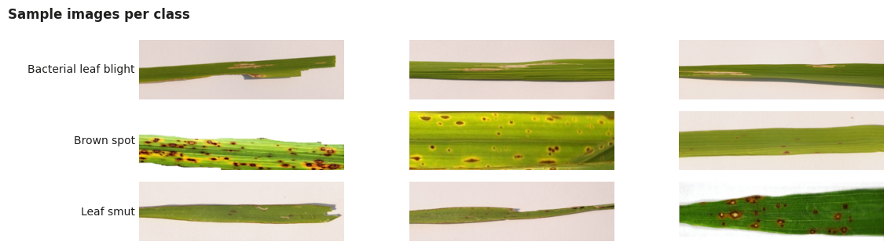
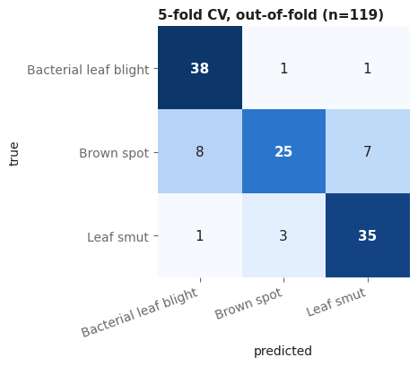
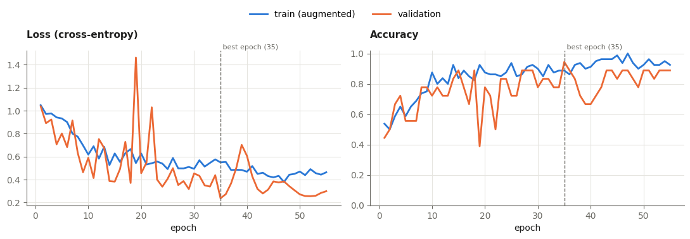
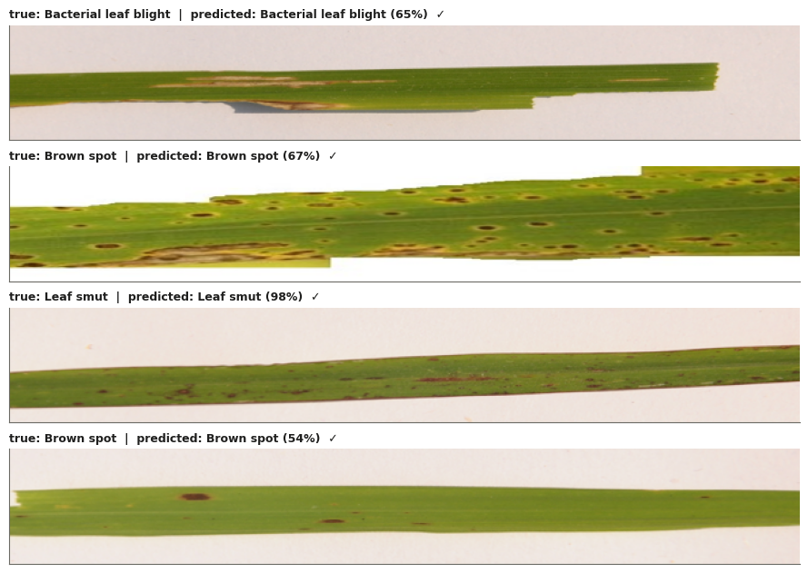
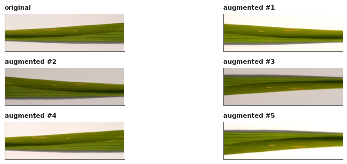

# 🌾 Rice Leaf Disease Detection — a CNN Built From Scratch in NumPy


A convolutional neural network that classifies a photo of a rice leaf as **Bacterial leaf blight**, **Brown spot** or **Leaf smut**.




---

## Table of Contents

- [Highlights](#-highlights)
- [Results](#-results)
- [Dataset](#-dataset)
- [Methodology](#-methodology)
- [Model Architecture](#-model-architecture)
- [Getting Started](#-getting-started)
- [Predicting a Single Image](#-predicting-a-single-image)
- [Project Structure](#-project-structure)
- [Limitations & Future Work](#-limitations--future-work)
- [Citation](#-citation)
- [Author](#-author)

---

## ✨ Highlights

- **Deep learning from first principles** — Conv2D (via `im2col`), BatchNorm, ReLU, MaxPool, Global Average Pooling, Dropout, Dense, softmax cross-entropy and AdamW, all implemented with forward *and* backward passes in NumPy.
- **Gradient-checked** — every layer and the full network pass a central-finite-difference check (max relative error < 1e-6).
- **Rigorous evaluation** — stratified train / validation / test split, test set used exactly once, plus **5-fold stratified cross-validation** with 95 % confidence intervals.
- **Data-driven design** — a dataset audit showed the leaves are long strips (~3.4 : 1), so the model uses **80 × 256** inputs instead of squashing them into a square.
- **Modern training recipe** — data augmentation, label smoothing, AdamW with decoupled weight decay, warm-up + cosine learning-rate schedule, gradient clipping, early stopping and test-time augmentation.
- **Portable checkpoint** — a single `model.npz` (≈ 360 KB) stores the weights *and* everything needed to use them (class names, input size, normalisation statistics).

---

## 📊 Results

| Evaluation | Accuracy | Macro-F1 | 95 % CI |
|---|:---:|:---:|:---:|
| **5-fold cross-validation** (pooled out-of-fold, n = 119) | **82.4 %** (98/119) | 0.817 | 75 % – 88 % |
| Cross-validation, mean ± std over folds | 82.2 % ± 15.4 | 0.806 ± 0.179 | — |
| Hold-out test set (n = 18) | 77.8 % (14/18) | 0.784 | 55 % – 91 % |

> Cross-validation uses every image as a test image exactly once, so it is the more reliable estimate. With only 18 test images, one prediction moves hold-out accuracy by 5.6 points.

**Per-class performance (5-fold CV, out-of-fold)**

| Class | Precision | Recall | F1-score | Support |
|---|:---:|:---:|:---:|:---:|
| Bacterial leaf blight | 0.809 | 0.950 | 0.874 | 40 |
| Brown spot | 0.862 | 0.625 | 0.725 | 40 |
| Leaf smut | 0.814 | 0.897 | 0.854 | 39 |

<p align="center">
  
</p>

**Brown spot** is the hardest class: it is most often confused with Leaf smut and Bacterial leaf blight, since all of them can show small dark lesions.

### Training curves



The weights with the lowest validation loss (epoch 35) are kept, and early stopping ends training after 20 epochs without improvement. Training loss sits *above* validation loss because training batches are augmented, pass through dropout and use smoothed labels.

### Predictions on unseen test images



---

## 🗂 Dataset

**Source:** [UCI Machine Learning Repository — Rice Leaf Diseases](https://archive.ics.uci.edu/dataset/486/rice+leaf+diseases) (CC BY 4.0)

| Class | Images | Typical appearance |
|---|:---:|---|
| Bacterial leaf blight | 40 | Long, straw-yellow streaks along the leaf |
| Brown spot | 40 | Round to oval brown spots |
| Leaf smut | 39 | Small, black, angular lesions |
| **Total** | **119** | |

**Audit findings that shaped the model**

- Most images are **3081 × 897 px** — long horizontal leaves — so inputs are resized to **80 × 256** to preserve lesion detail.
- **Resolution correlates with the label:** every Bacterial-leaf-blight image is 3081 × 897, while the other classes mix sizes from several sources. All images are resized to the same input size, but the model could still learn resampling or compression artefacts. This is noted as a possible shortcut (see [Limitations](#-limitations--future-work)).

---

## 🔬 Methodology

### 1. Preprocessing & split
- Images are converted to RGB, rotated to landscape if needed, and resized to **80 × 256** (bicubic).
- **Stratified 70 / 15 / 15 split** → 83 train / 18 validation / 18 test images, with equal class balance in each.
- Pixels are standardised per channel using statistics from the **training set only**, so nothing leaks from validation or test.

### 2. Data augmentation (training only)

| Transform | Range | Why the label is unchanged |
|---|---|---|
| Random crop → resize back | each side keeps 80–100 % | disease does not depend on framing |
| Horizontal & vertical flip | p = 0.5 each | a leaf has no canonical orientation |
| Brightness / contrast / saturation | ± 15 % | lighting and colour balance vary |

**Hue is deliberately not changed** — lesion colour (straw-yellow, brown, black) is diagnostic.



### 3. Training setup

| Setting | Value |
|---|---|
| Optimiser | AdamW (decoupled weight decay 1e-4; biases and BatchNorm exempt) |
| Learning rate | 2e-3, 3-epoch linear warm-up, cosine decay to 1e-5 |
| Batch size | 16 (`drop_last`, so BatchNorm never sees a tiny batch) |
| Loss | Softmax cross-entropy with label smoothing ε = 0.1 |
| Regularisation | Dropout 0.3, weight decay, data augmentation |
| Gradient clipping | global L2 norm ≤ 5 |
| Model selection | lowest validation loss; early stopping (patience 20, max 80 epochs) |
| Inference | test-time augmentation (original + horizontal flip + vertical flip) |
| Seed | 42 |

### 4. Gradient verification
Each analytic gradient is compared with a central finite difference in float64:

| Layer | Max relative error | Status |
|---|:---:|:---:|
| Conv2D (stride 1, same padding) | 6.0e-08 | ✅ |
| Conv2D (stride 2) | 1.0e-08 | ✅ |
| BatchNorm2D | 4.9e-08 | ✅ |
| ReLU | 9.6e-11 | ✅ |
| MaxPool2D | 8.0e-09 | ✅ |
| GlobalAvgPool2D | 3.2e-10 | ✅ |
| Dense | 5.5e-10 | ✅ |
| Softmax cross-entropy | 2.0e-10 | ✅ |
| **Full network** | **2.9e-08** | ✅ |

The notebook also explains the maths behind each layer (im2col convolution, BatchNorm backward, He initialisation, AdamW, the softmax-cross-entropy gradient).

---

## 🧠 Model Architecture

Four blocks of **Conv 3×3 → BatchNorm → ReLU → MaxPool 2×2**, then Global Average Pooling, Dropout and a 3-way Dense layer.

```
Input (3, 80, 256)
 ├─ Block 1: Conv(3→16)   → BN → ReLU → MaxPool   → (16, 40, 128)
 ├─ Block 2: Conv(16→32)  → BN → ReLU → MaxPool   → (32, 20, 64)
 ├─ Block 3: Conv(32→64)  → BN → ReLU → MaxPool   → (64, 10, 32)
 ├─ Block 4: Conv(64→128) → BN → ReLU → MaxPool   → (128, 5, 16)
 ├─ Global Average Pooling                         → (128,)
 ├─ Dropout (p = 0.3)
 └─ Dense (128 → 3) + Softmax                      → (3,)

Total trainable parameters: 98,067
```

**Why Global Average Pooling?** The first version of this project used `Flatten → Dense(100)`, which put about **819,000 parameters** into a single layer — easy to over-fit with ~120 images. GAP shrinks the classifier head to **387 parameters**, and the whole network to under 100 K.

---

## 🚀 Getting Started

### Prerequisites
- Python 3.9+
- `numpy`, `pillow` (≥ 9.1), `matplotlib`, `jupyter`

### Installation

```bash
git clone https://github.com/Sirajul-Islam6335/Data-Science-Rice-Leaf-Disease-detection.git
cd Data-Science-Rice-Leaf-Disease-detection

python -m venv .venv
source .venv/bin/activate        # Windows: .venv\Scripts\activate

pip install -r requirements.txt
```

### Run the notebook

```bash
jupyter notebook Rice_Leaf_Disease_CNN_f.ipynb
```

Run all cells. The dataset is already included in `mydata/`, organised as one sub-folder per class:

```
mydata/
├── Bacterial leaf blight/
├── Brown spot/
└── Leaf smut/
```

On a standard CPU, a full training run takes about **2 minutes**; 5-fold cross-validation adds roughly 10 minutes (set `run_cv=False` in `CONFIG` to skip it). You can also open the notebook in **Google Colab** and upload the `mydata/` folder.

All hyper-parameters live in one `CONFIG` dictionary at the top of the notebook, so an experiment is fully described by `CONFIG` and the random seed.

---

## 🔍 Predicting a Single Image

After running the notebook cells that define the model and the helpers (`load_checkpoint`, `predict_image`), you can classify any leaf photo with the saved checkpoint:

```python
model, meta = load_checkpoint("model.npz")
result = predict_image("path/to/leaf.jpg", model, meta)
print(result)
```

Example output (for a Bacterial-leaf-blight image from the test set):

```json
{
  "label": "Bacterial leaf blight",
  "confidence": 0.6494,
  "uncertain": false,
  "probabilities": {
    "Bacterial leaf blight": 0.6494,
    "Brown spot": 0.1078,
    "Leaf smut": 0.2428
  }
}
```

`uncertain` is `true` when the top probability is below 0.6 — a cue for human review, since the model only knows these three diseases.

---

## 📁 Project Structure

```
Data-Science-Rice-Leaf-Disease-detection/
├── Rice_Leaf_Disease_CNN_f.ipynb   # Full pipeline: audit → CNN engine → training → evaluation
├── model.npz                     # Trained weights + metadata (class names, input size, normalisation)
├── mydata/                       # Dataset: one folder per class (119 images)
│   ├── Bacterial leaf blight/
│   ├── Brown spot/
│   └── Leaf smut/
├── Bactorial_leaf_blight.jpg     # Sample images for quick prediction
├── brown_spot.jpg
├── leaf_smut.jpg
├── assets/                       # Figures used in this README
├── requirements.txt
└── README.md
```

---

## ⚠️ Limitations & Future Work

**Limitations**
- **Small dataset:** 119 images, essentially from one source. Accuracy on real field photos (cluttered backgrounds, different cameras) is likely to be lower.
- **Possible shortcut:** every Bacterial-leaf-blight image has the same resolution, which the model could exploit.
- **Closed world:** healthy leaves or other diseases are always forced into one of the three classes.
- **High variance:** fold accuracies range from 61 % to 96 %, so results still depend on which images land in training.

**Next steps**
- Collect more, and more varied, field images (the biggest lever for improvement)
- Two convolutions per block and higher input resolution for small lesions
- Mixup / CutMix augmentation and probability calibration
- Grad-CAM visualisations to show where the model looks
- A "healthy" class and out-of-distribution detection
- Compare against a transfer-learning baseline (e.g. a pretrained ResNet / EfficientNet)

---

## 📚 Citation

Dataset:

> J. Shah, H. Prajapati, V. Dabhi (2017). *Rice Leaf Diseases* [Dataset]. UCI Machine Learning Repository. https://doi.org/10.24432/C5R013 — licensed under [CC BY 4.0](https://creativecommons.org/licenses/by/4.0/).

---

## 👤 Author

**Sirajul Islam**
GitHub: [@Sirajul-Islam6335](https://github.com/Sirajul-Islam6335)

If you found this project useful, consider giving it a ⭐!
